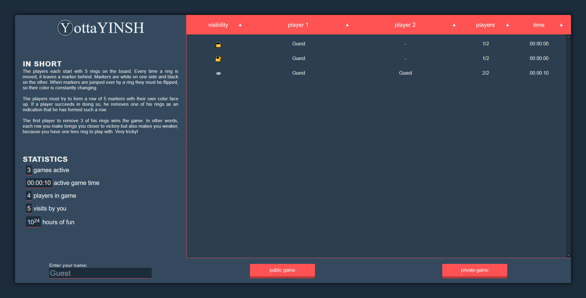
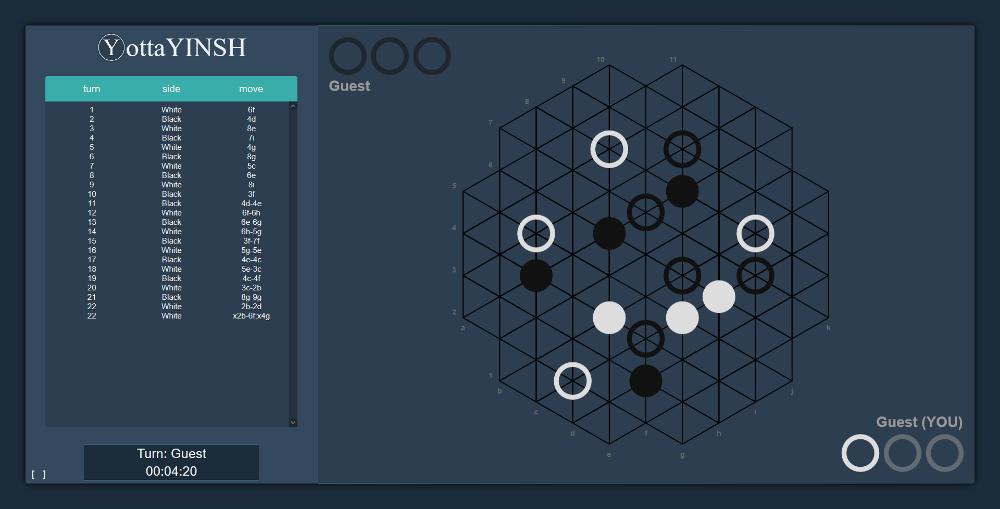

# YottaYINSH
[YINSH](http://www.gipf.com/yinsh/) implementation with client and server communication using WebSocket.

# Splash screen

# Game screen

# Additional information
This game was made as a project for CSE1500. It validates all the moves and requests to private games from the client on the server, this makes it quite uncrackable unless you manage to brute force a session or private game id.
Client side code injection with names is also not possible due to filtering/replacing of left and right angle bracket.
